**program:**

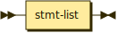

```
program  ::= stmt-list
```

**stmt-list:**

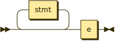

```
stmt-list
         ::= stmt* e
```

referenced by:

* program
* stmt-block

**stmt:**

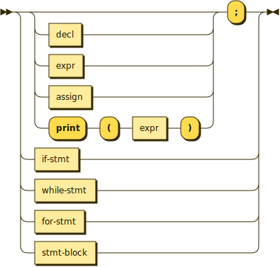

```
stmt     ::= ( decl | expr | assign | 'print' '(' expr ')' )? ';'
           | if-stmt
           | while-stmt
           | for-stmt
           | stmt-block
```

referenced by:

* for-stmt
* if-stmt
* stmt-list
* while-stmt

**stmt-block:**

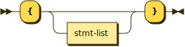

```
stmt-block
         ::= '{' stmt-list? '}'
```

referenced by:

* stmt

**decl:**

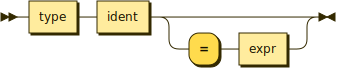

```
decl     ::= type ident ( '=' expr )?
```

referenced by:

* for-init
* stmt

**type:**

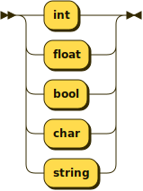

```
type     ::= 'int'
           | 'float'
           | 'bool'
           | 'char'
           | 'string'
```

referenced by:

* decl

**assign:**

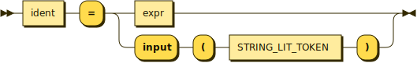

```
assign   ::= ident '=' ( expr | 'input' '(' STRING_LIT_TOKEN ')' )
```

referenced by:

* for-init
* for-iter
* stmt

**if-stmt:**

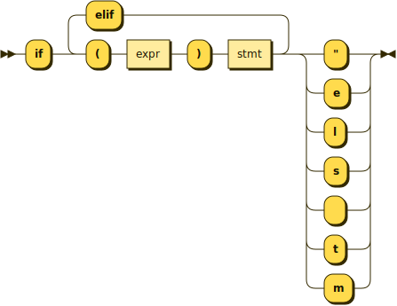

```
if-stmt  ::= 'if' '(' expr ')' stmt ( 'elif' '(' expr ')' stmt )* ( 'else' stmt )?
```

referenced by:

* stmt

**while-stmt:**


```
while-stmt
         ::= 'while' '(' expr ')' stmt
```

referenced by:

* stmt

**for-stmt:**

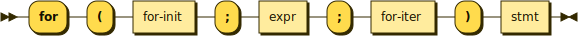

```
for-stmt ::= 'for' '(' for-init ';' expr ';' for-iter ')' stmt
```

referenced by:

* stmt

**for-init:**

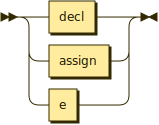

```
for-init ::= decl
           | assign
           | e
```

referenced by:

* for-stmt

**for-iter:**

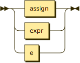

```
for-iter ::= assign
           | expr
           | e
```

referenced by:

* for-stmt

**expr:**

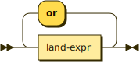

```
expr     ::= land-expr ( 'or' land-expr )*
```

referenced by:

* assign
* decl
* for-iter
* for-stmt
* func-tail
* if-stmt
* primary-expr
* stmt
* while-stmt

**land-expr:**

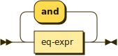

```
land-expr
         ::= eq-expr ( 'and' eq-expr )*
```

referenced by:

* expr

**eq-expr:**

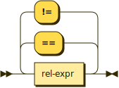

```
eq-expr  ::= rel-expr ( ( '==' | '!=' ) rel-expr )*
```

referenced by:

* land-expr

**rel-expr:**

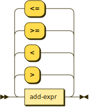

```
rel-expr ::= add-expr ( ( '>' | '<' | '>=' | '<=' ) add-expr )*
```

referenced by:

* eq-expr

**add-expr:**


```
add-expr ::= mult-expr ( ( '+' | '-' ) mult-expr )*
```

referenced by:

* rel-expr

**mult-expr:**

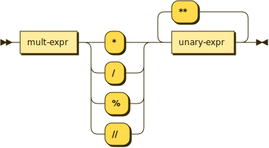

```
mult-expr
         ::= mult-expr ( '*' | '/' | '%' | '//' ) unary-expr ( '**' unary-expr )*
```

referenced by:

* add-expr
* mult-expr

**unary-expr:**

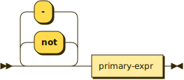

```
unary-expr
         ::= ( 'not' | '-' )* primary-expr
```

referenced by:

* mult-expr

**primary-expr:**

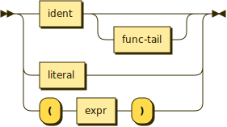

```
primary-expr
         ::= ident func-tail?
           | literal
           | '(' expr ')'
```

referenced by:

* unary-expr

**func-tail:**

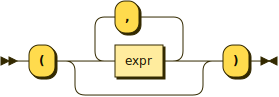

```
func-tail
         ::= '(' ( expr ( ',' expr )* )? ')'
```

referenced by:

* primary-expr

**literal:**

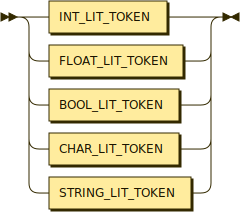

```
literal  ::= INT_LIT_TOKEN
           | FLOAT_LIT_TOKEN
           | BOOL_LIT_TOKEN
           | CHAR_LIT_TOKEN
           | STRING_LIT_TOKEN
```

referenced by:

* primary-expr

**ident:**

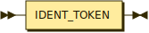

```
ident    ::= IDENT_TOKEN
```

referenced by:

* assign
* decl
* primary-expr

## 
 <sup>generated by [RR - Railroad Diagram Generator][RR]</sup>

[RR]: https://www.bottlecaps.de/rr/ui